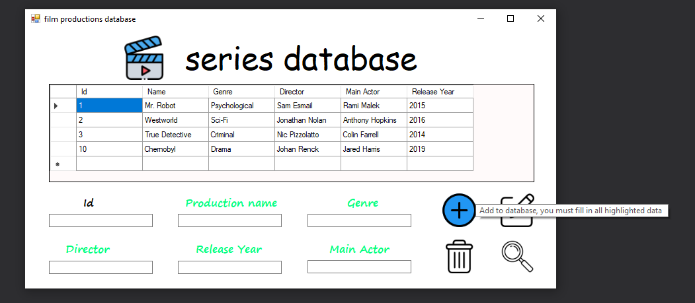

## About

The application was created as a homework for the Kredek science club.

The application allows you to perform CRUD operations on the created database. 

## Try it 

To test the application import the script.sql into SQL Management Studio and host the server.

You also need to replace a ConnectionString in Resources.resx file to your own:

"Right-click on your connection and select "Properties". You will get the Properties window for your connection. Find the "Connection String" property and select the "connection string". So now your connection string is in your hands; you can use it anywhere you want."

## Preview

